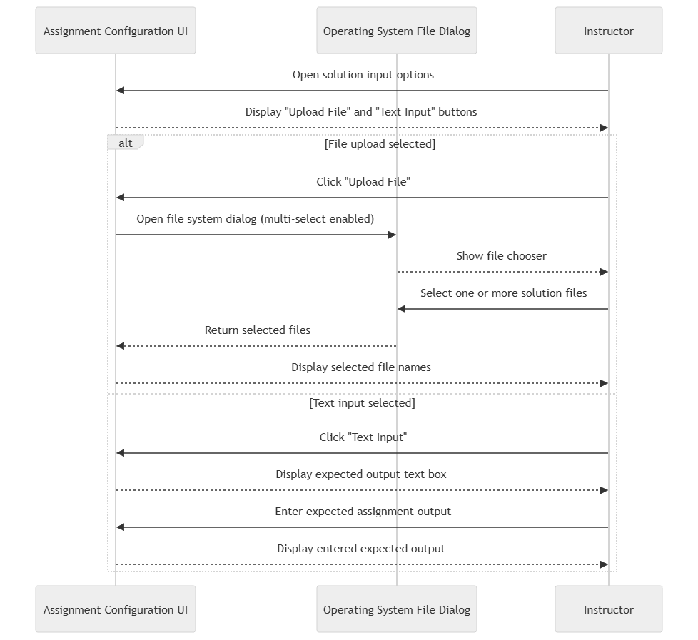

# FR10: Solution Upload Buttons & Display

## Description
As part of FR9, there are two buttons (Similar to FR1):

- One button supports multiple file upload attempts until FR11 is used.
- The other button allows for text to be uploaded until FR11 is used.

## Diagrams
Sequence Diagram: ```/designs/MVP-5/FR-10/FR-10-v02-SEQ-Solution-Upload```


Information about the non-submitted file uploads is not logged by any databases.

## Diagram Discription
Figure 4.5.2 illustrates the updated interaction flow for FR-10, which enables instructors to define assignment solutions through either file upload or direct text input. In the file upload path, the instructor selects the upload option, which opens the operating system file dialog with multi-selection enabled. The instructor may then select one or more solution files, and the selected files are returned to the Assignment Configuration UI, where their file names are displayed for confirmation. In the text input path, the instructor selects the text input option, causing the UI to display a text box for direct expected output entry. This update reflects the revised FR-10 behavior needed to support multi-file C++ assignments.