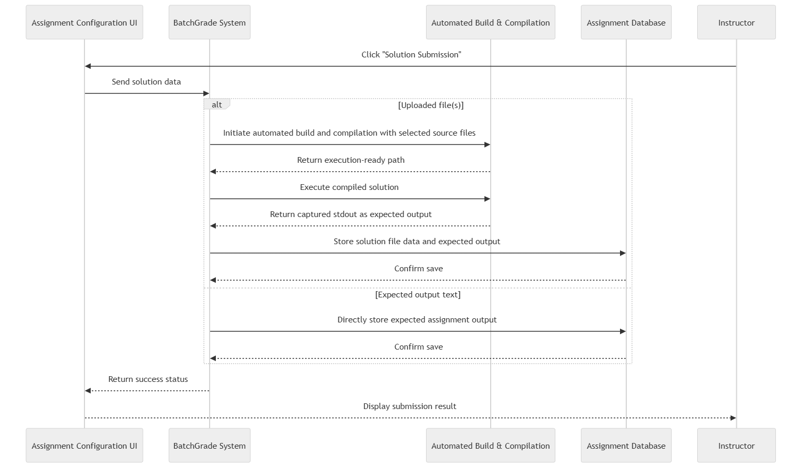

# FR11: Solution Submission Button & Display

As part of FR9, the button cannot be used until a solution is uploaded by either method from FR10. Similar to FR2, an error message will appear if not properly used.
Upon successful submission of a file upload, followed by FR3, submission information will be created/compiled but stored as part of the assignment information in FR9, rather than directly stored in FR7 or FR13.
If the solution was uploaded as text instead, the text will be stored as expected output in the assignment information in FR9 and in FR5.

**UPDATED**
Figure 4.5.3 illustrates the updated interaction flow for FR-11, which finalizes solution submission based on the input method selected in FR-10. When the uploaded file option is used, the Assignment Configuration UI sends the selected solution data to the BatchGrade system. The system then passes one or more selected source files into the Automated Build & Compilation service, which compiles and executes the solution to generate expected output. That expected output, along with the uploaded solution file data, is then stored in the Assignment Database. In the alternate text-input flow, the system directly stores the instructor-entered expected output without invoking compilation. This update reflects support for multi-file C++ assignments and ensures that solution submission correctly handles programs requiring more than one source file.