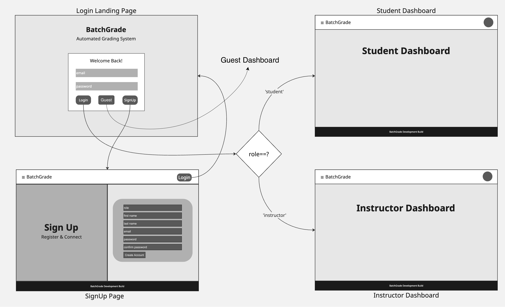

# FR12 User Login Buttons & Display

## Description
After clicking one of the two buttons intended for their role, the user must input their name and some information indicating their specific class, such as an NSHE ID, email, class code, or instructor code. The first time the user logs into the application, user information, including a unique ID, will be created and compiled. All user information will be stored in FR13. If the login information already exists in the system, they are treated as a current user.

## Diagrams
Sequence Diagram: ```/designs/MVP-6/FR-12/FR-12-v03-SEQ-UserLoginFlow```


## Diagram Discription
Figures 4.6.2 & 4.6.3 demonstrate MVP-6: FR-12 authentication as a two-branch sequence driven by credential validation. After this user opens the Login UI and submits email/password, the client passes login data to AuthService, which validates the user against UserStore. If a matching account is found, the system establishes authenticated context and routes the user to the appropriate dashboard. If no valid account is found, the system returns an error response and the Login UI displays a clear failure message without navigation. This design separates user interaction, authentication logic, and persistence lookup while making both success and failure behavior explicit.
